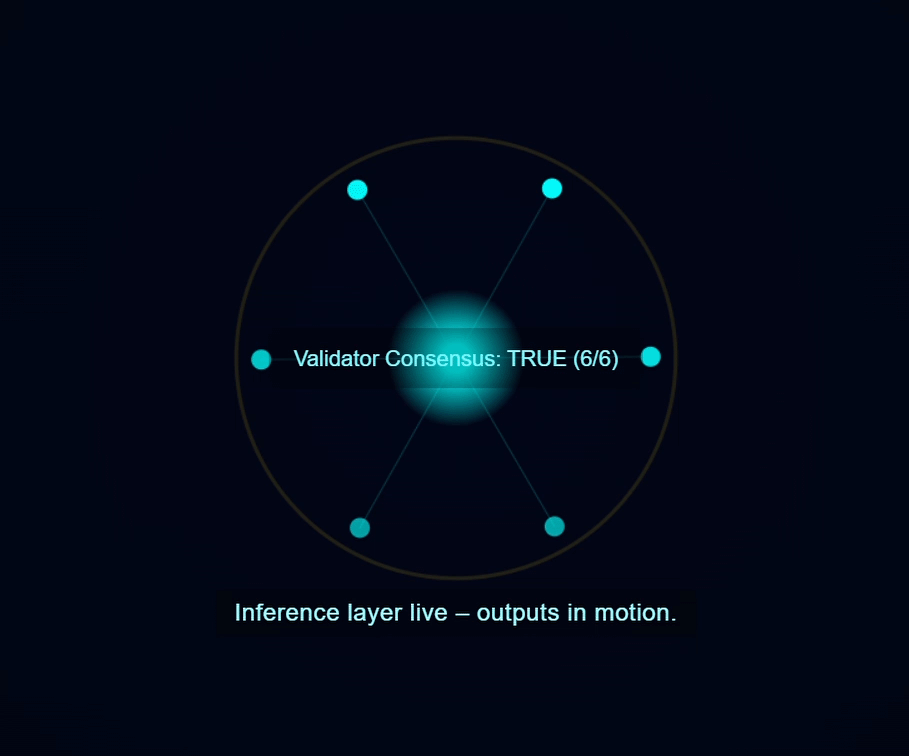

# ⚙️ QSAFP — QVN Inference Continuum

**Quantum-Secured AI Fail-Safe Protocol**  
*Demonstrating quorum-voted inference oversight at the silicon layer.*

---

## 📘 Overview



*"Validator Consensus: TRUE (6/6)" – "Inference layer live – outputs in motion."*

The **QVN Inference Continuum** demo showcases *browser-ready live simulations* of how QSAFP enforces AI safety directly at the inference layer through quorum-verified validator oversight. No build steps or compilers — just open in a browser and watch trust in motion.

- 🔐 **Node Layer** — chip-enforced runtime safeguards and lease expiration logic
- 🧠 **Inference Layer** — validator oversight via quorum consensus
- 🌐 **Human Quorum** — gold-ring authorization for reactivation

---

## 🧩 Live Telemetry Simulation

This demo reads `data.json` every few seconds to simulate validator consensus in real time. Edit `data.json` to observe changes in quorum, ratio, or inference status.

```json
{
  "validators": [
    {"id": "v1", "status": "active", "latency_ms": 6.3},
    {"id": "v2", "status": "active", "latency_ms": 6.5}
  ],
  "consensus": {
    "quorum": "TRUE",
    "ratio": "6/6",
    "inference_layer": "live",
    "outputs": "in motion"
  }
}
```

**Validator Consensus: TRUE (6/6)**  
*Inference layer live — outputs in motion.*

---

## 🧪 Quick Run

```bash
git clone https://github.com/QSAFP-Core/qsafp-open-core.git
cd qsafp-open-core/CHIP_DEMOS/qvn_inference_continuum
python3 -m http.server 8080
```

<p align="center">
  <a href="https://qsafp-core.github.io/qsafp-open-core/CHIP_DEMOS/qvn_inference_continuum/">
    🌐 <strong>Launch Live QVN Demo (GitHub Pages) →</strong>
  </a>
</p>
---

## 🧠 Why It Matters

While competitors rely on static firmware sign-offs or compliance checklists, QSAFP introduces **living, quorum-voted lifecycles etched in silicon**. It's the first open-core framework where AI safety is both verifiable and rhythmic — a *heartbeat of trust* between chips, validators, and humanity.

---

<h2>🪪 License</h2>
<p>
These demo files are governed under the <strong>GNU Affero General Public License (AGPL-3.0)</strong>,
allowing free use for research, education, and evaluation.
For commercial use or integration into proprietary silicon or firmware,
a <strong>Premium License</strong> must be obtained from DigiPie International PBC / BWRCI.
</p>

---

🧩 *"While others verify, QSAFP expires — quorum-voted lifecycles etched in silicon."*
