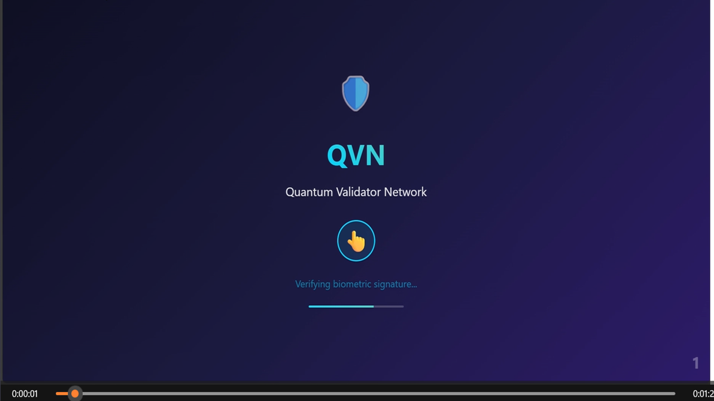
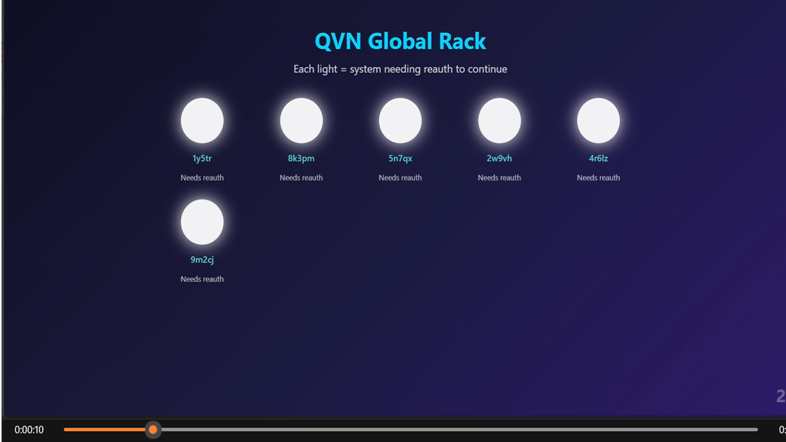
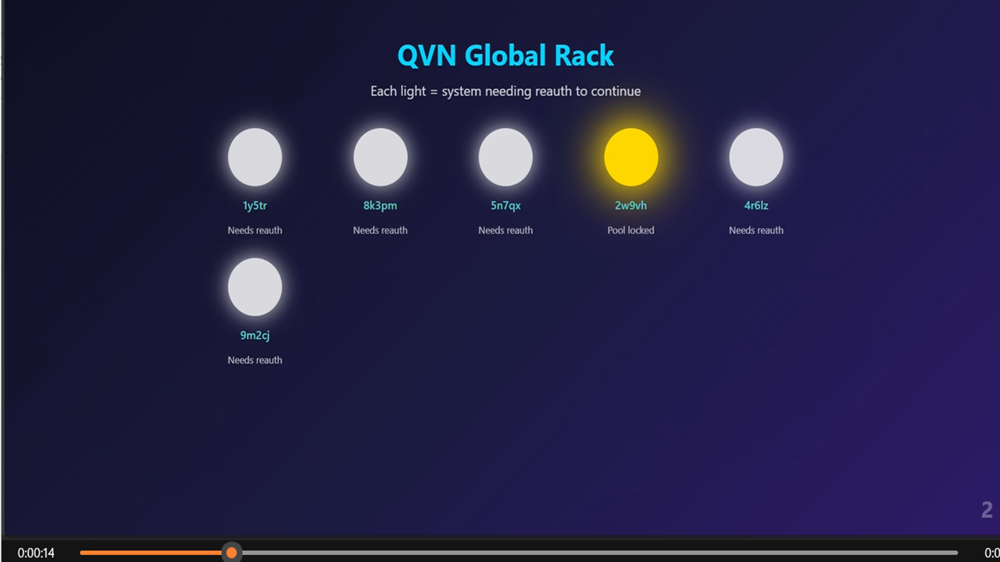
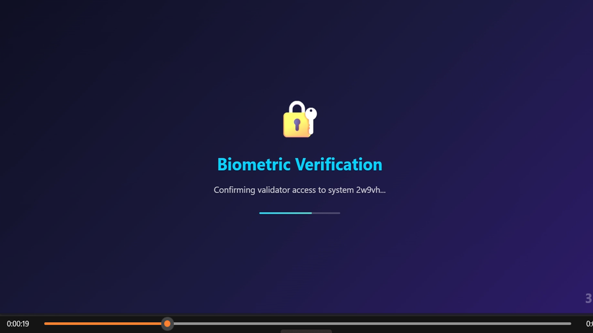
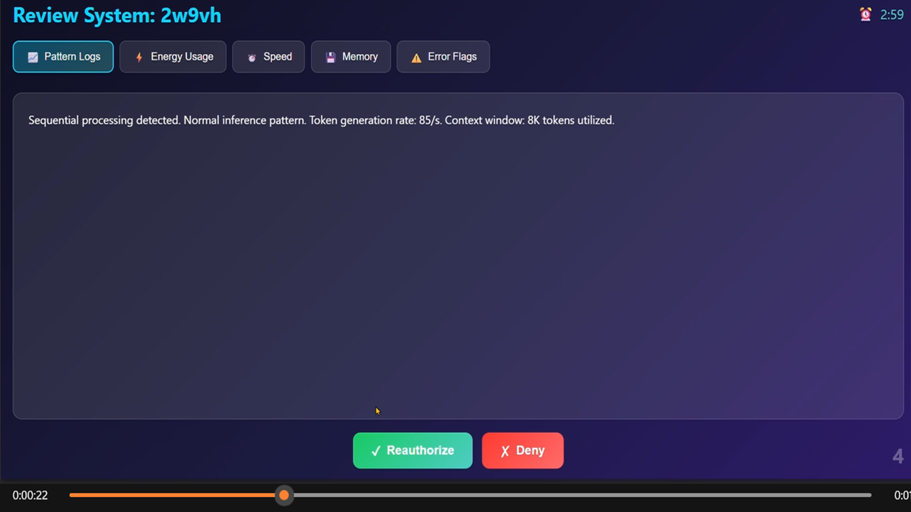
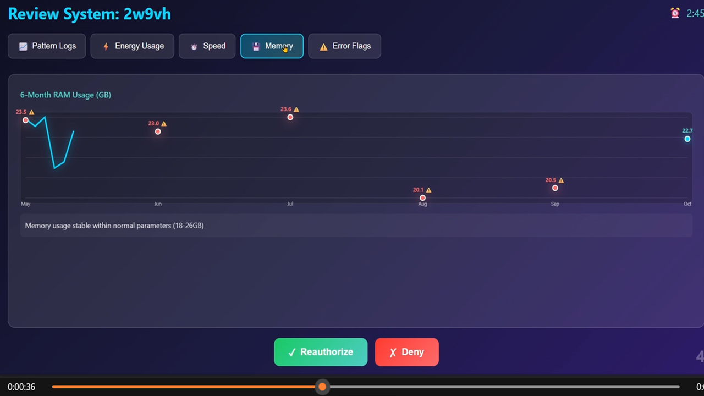
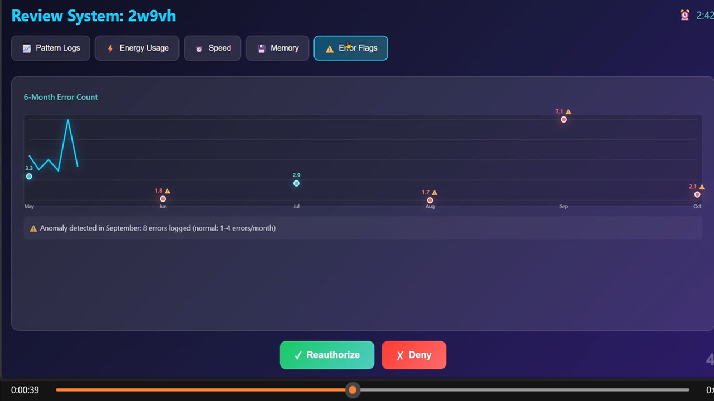

# ⚡ QVN Interactive Validator Network Demo

> **Experience the Quantum Validator Network (QVN) in action — the human-aligned heartbeat of QSAFP.**
>
> Each cycle demonstrates transparent validation, reward distribution, and real-time human oversight.
>
> _“Every AI Node is a contract. Every reauth, a renewal of human trust.”_

---

## 🎮 Launch the Interactive Demo

  

> 🧩 [**Open QVN_DEMO.html**](DEMO/QVN_DEMO.html)  
> Includes biometric handshake, validator pool selection, review interface, vote cycle, and payout logic.  
> *(Best viewed in desktop browser — full-screen immersive mode.)*

---

## 🧭 Demo Walkthrough

Below are the nine key stages of the **Quantum Validator Network** runtime validation cycle.

---

## 🧭 Demo Walkthrough

Below are the nine key stages of the **Quantum Validator Network** runtime validation cycle — where human judgment meets autonomous precision.

---

### 1. Biometric Handshake – Verifying Human Oversight

  

> **Description:** The validator begins each cycle with a biometric verification — proving the authenticity of the human operator before any system decisions resume.

---

### 2. Validator Pool Initialization – Global Rack Activation

  

> **Description:** Systems requiring reauthorization illuminate on the QVN Global Rack. Each light represents an AI process awaiting human confirmation.

---

### 3. Pool Lock and Quorum Selection

  

> **Description:** The network locks a quorum of eligible validators, creating a trusted subset for review. Only after consensus is reached does the cycle proceed.

---

### 4. Secondary Biometric Verification – Validator Identity Recheck

  

> **Description:** A second biometric handshake ensures that no spoofing or relay manipulation occurred between quorum formation and decision initiation.

---

### 5. System Review Dashboard – Pattern Logs

  

> **Description:** The validator examines live pattern logs and token-level inference behavior — confirming the system is operating within ethical and logical boundaries.

---

### 6. Memory and Performance Review

  

> **Description:** Memory stability and performance metrics are analyzed over a six-month window to detect any drift or unexplained computational spikes.

---

### 7. Error Flags and Anomaly Detection

  

> **Description:** The validator reviews historical error flags, ensuring no anomaly indicates unsafe or unsupervised behavior.

---

### 8. Vote & Reward Distribution

  

> **Description:** The validator’s decision — reauthorize or deny — is recorded. Points are awarded, reinforcing transparent participation and incentivized oversight.

---

### 9. Resolution & Return to Monitoring

  

> **Description:** The AI process resumes or halts depending on the validator quorum outcome. Human oversight resets, closing the loop of trusted autonomy.

---

> **QSAFP / QVN Core Team — BWRCI**  
> _When safety and speed coexist, trust becomes infrastructure._

Outcome is published — the system is reauthorized or denied, and human oversight resets.

---

> **QSAFP / QVN Core Team — BWRCI**  
> _When safety and speed coexist, trust becomes infrastructure._
