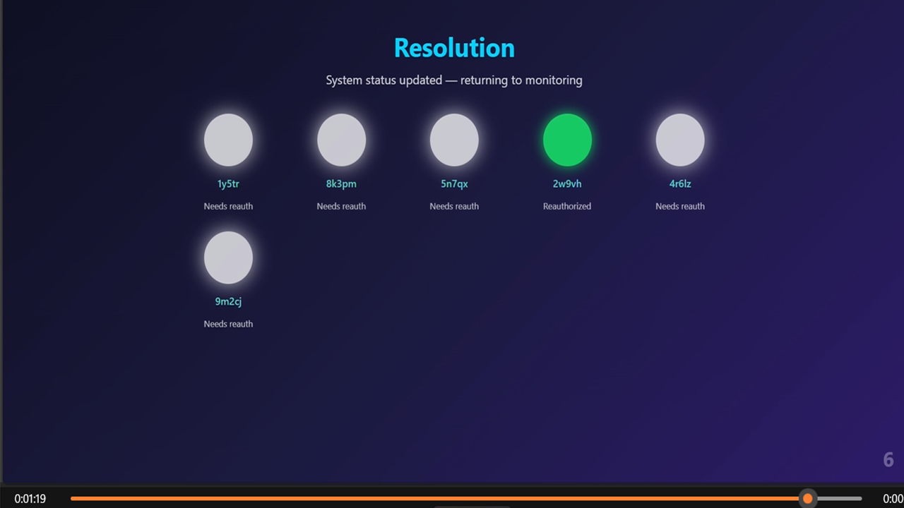

# ⚡ QVN Interactive Validator Network Demo

> **Experience the Quantum Validator Network (QVN) in action — the human-aligned heartbeat of QSAFP.**
>
> Each cycle demonstrates transparent validation, reward distribution, and real-time human oversight.
>
> _“Every AI Node is a contract. Every reauth, a renewal of human trust.”_

---

## 🎮 Launch the Interactive Demo

  

> 🧩 [**Open QVN_DEMO.html**](DEMO/QVN_DEMO.html)  
> Includes biometric handshake, validator pool selection, review interface, vote cycle, and payout logic.  
> *(Best viewed in desktop browser — full-screen immersive mode.)*

---

## 🧭 Demo Walkthrough

Below are the nine key stages of the **Quantum Validator Network** runtime validation cycle.

---

  

  

  

  

  

  

  

  

  

Outcome is published — the system is reauthorized or denied, and human oversight resets.

---

> **QSAFP / QVN Core Team — BWRCI**  
> _When safety and speed coexist, trust becomes infrastructure._
