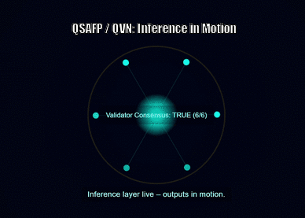
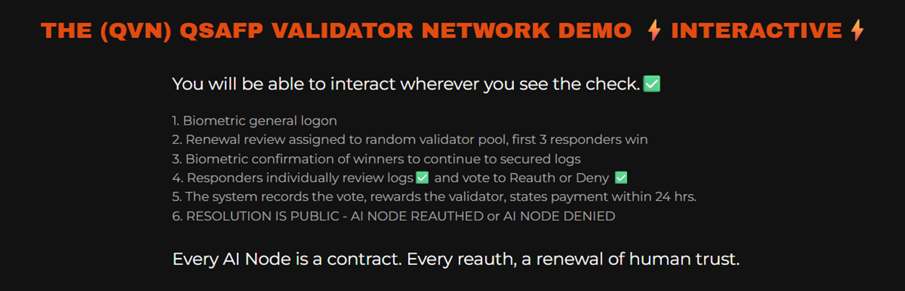

<div align="center">


### 🧠 Quantum-Secured AI Fail-Safe Protocol (QSAFP)

_Runtime sovereignty and validator-driven safety for the AI era._

**License:** [AGPL-3.0](./LICENSE.txt) *(Open Core)*  
🔒 Commercial integration and proprietary implementations require a **Premium License**  
from **DigiPie International PBC / BWRCI** — contact [licensing@bwrci.org](mailto:licensing@bwrci.org)

[AGPL-3.0 License](./LICENSE.txt) • [Chip-Level Demo](./CHIP_DEMOS/qvn_inference_continuum/README.md) • v1.0  
Maintained by **DigiPie International PBC / BWRCI**

</div>

---# 🧩 QSAFP — Quantum-Secured AI Fail-Safe Protocol
_Runtime sovereignty for autonomous AI systems — safety without slowdown.

---

### ⚡ Inference-Level Sovereignty  

Only inference-level shutdowns are **technically meaningful**, because this is where *sovereignty is proven, not performed*.  
Human oversight at the inference layer ensures that every action, response, or propagation event remains verifiably aligned with authorized governance.

> **Build Kit v1.0** was engineered specifically for *runtime inference*, not for training orchestration.  
> It features zero-latency safety hooks, asynchronous validator calls, and deterministic oversight —  
> optimized to run flawlessly on inference-class GPUs (L4, T4, GroqChip series).

---

## ⚙️ Chip-Level Demonstration  
**QVN Inference Continuum**  
_Quorum-voted inference oversight rendered live._

<p align="center">
  <a href="CHIP_DEMOS/qvn_inference_continuum/index.html">
    
  </a>
</p>

<p align="center">
  <a href="https://qsafp-core.github.io/qsafp-open-core/CHIP_DEMOS/qvn_inference_continuum/">
    🌐 <strong>Launch Live QVN Demo (GitHub Pages) →</strong>
  </a>
</p>
---
### 🔐 Protocol Overview  

**QSAFP (Quantum-Secured AI Fail-Safe Protocol)** is a cryptographic enforcement layer designed to guarantee runtime accountability for autonomous AI.  
It provides a sovereign-grade fallback that protects national, enterprise, and mission-critical systems against catastrophic AI misalignment or external compromise.

Core safeguards include:  
- **Ephemeral Key Lease (EKL)** — a pre-quantum mechanism for short-duration execution leases  
- **Validator Consensus** — multi-party quorum logic confirming safe operation  
- **Fail-Safe Rollback** — deterministic state restoration after anomaly detection  
- **Quorum Override Audit Trails** — permanent cryptographic evidence of governance events  

---

### 🚀 QSAFP v2.1 — Build Kit v1.0 Highlights

| Feature | Description |
|:--------|:-------------|
| 🧠 Inference Layer Oversight | Proven runtime sovereignty at point of action |
| 🔐 Ephemeral Key Lease (EKL) | Cryptographic expiration of authority windows |
| 🧩 Validator Consensus | Multi-party synchronization under 1 second |
| ⚙️ Deterministic Fail-Safe | Controlled rollback + containment without latency |
| 🧾 Quorum Audit Trails | Permanent cryptographic proof of validator decisions |
| 🧮 PQC Signatures | Quantum-resistant execution verification |

---

### 🧬 Ephemeral Key Lease (EKL)  

The EKL mechanism serves as a **temporary cryptographic lease**, ensuring that any AI process operates only within a verified time window.  
When a lease expires or a validator quorum withdraws consent, runtime control automatically transitions to containment mode.  

QSAFP v2.1 leverages EKL as a pre-quantum placeholder while preparing for **Quantum Key Distribution (QKD)** integration as infrastructure matures.

---

### 🧰 Standards Alignment & Build Kit v1.0  

This repository represents the **reference implementation** of QSAFP v2.1, which has been submitted to the  
**NIST AI Standards Zero Draft Pilot** for evaluation as a *hardware-embedded execution-control overlay* aligned with the  
**NIST AI Risk Management Framework (AI RMF)**.

**Purpose of this repo for reviewers and collaborators:**  
- Provide an **open-core proof-of-concept** for execution leases, validator quorum overrides, and cryptographic audit trails.  
- Enable **testing + feedback** from NIST, the AI Safety Institute (AISI), and global partners.  
- Support QSAFP’s candidacy for strengthening the *Govern*, *Map*, and *Manage* functions within AI RMF.

> ⚠️ This repository demonstrates **core mechanisms only** (execution leases, timers, PQC signatures, integration scaffolding).  
> It is *not* a production-ready security library — hardware TEE, board-level controllers, and silicon IP integrations remain road-map items.

---

## ⚡ QVN Validator Network Demo — Interactive

<p align="center">
  
</p>

<p align="center"><em>
You will be able to interact wherever you see the check. ✅
</em></p>
<p align="center">
  
</p>

<p align="center"><em>
QVN — Quantum Validator Network in motion.  
Verifying biometric signature... trust rendered at runtime.
</em></p>


---

<h2 align="center">🚀 Quick Start Demo</h2>


🧾 Licensing & Use Notice

This project is released under an **open-core model**.

✅ **Permitted (Open Source):**
- Research, educational, and non-commercial testing under **GNU Affero General Public License (AGPL-3.0)**.

🚫 **Restricted (Commercial):**
- Embedding QSAFP leases, quorum controls, or cryptographic audit trails in proprietary products  
  without a **Premium License** from **DigiPie International PBC** or **BWRCI**.

**Effective Date:** October 1, 2025
---
### 🌐 References & Community

- **Official Docs:** [https://qsafp-core.github.io/qsafp-open-core/](https://qsafp-core.github.io/qsafp-open-core/)
- **Integration Guide:** [View →](integration_kit_v1_0/README.md)
- **Validator Emulator:** [`demo/validator_emulator.py`](demo/validator_emulator.py)
- **Build Notes:** [`integration_kit_v1_0/docs`](integration_kit_v1_0/docs/)

> “Sovereignty in runtime is the new firewall of the AI era.”
```bash
# 1. Clone the repo
git clone https://github.com/QSAFP-Core/qsafp-open-core.git
cd qsafp-open-core/v2.1

# 2. Install dependencies
npm install

# 3. Run the interactive demo
npm run demo
