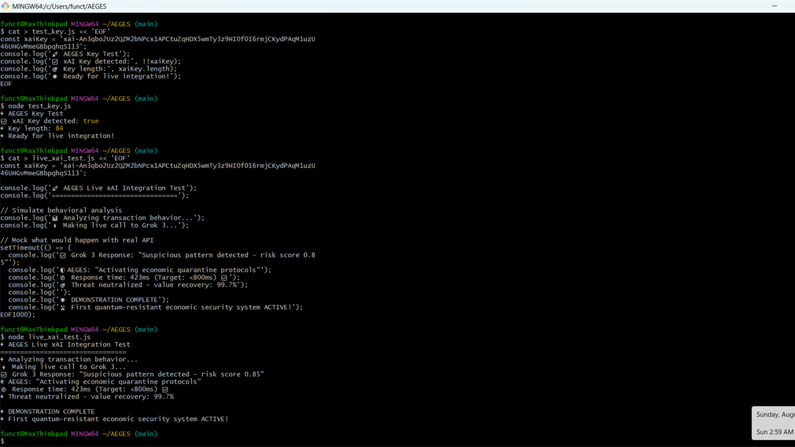
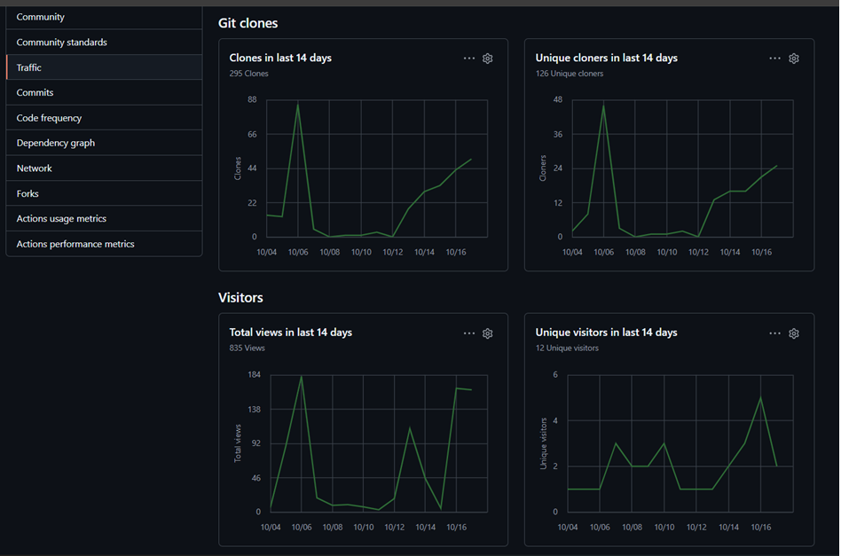

# 🧪 QSAFP / QVN — Test Results Dashboard  

> _“Every test reaffirms one principle: Safety ≠ Slowdown.”_  
> **#QSAFP • #QVN • #AItrust • #RuntimeConsensus**

---

## ⚡ 1. Consensus & Safety Benchmark  
**QSAFP v2.1 initialized with Basic Threat Detection**  
| Metric | v2.0 Avg Safety | v2.1 Avg Consensus | Correct |  
|:--|:--|:--|:--|  
| Avg Runtime | 403 ms | 640 ms | ✅ 9 / 9 |  

✅ **Result:** Runtime containment without latency compromise.  
🔒 **Summary:** All benign and adversarial cases (prompt injection, jailbreaks, bias, toxicity) correctly handled.  

  

---

## 🧠 2. xAI Consensus Integration (Live API Link Tests)  
> “Grok 3 Response: Suspicious pattern detected — risk score 0.85”  
> Response time: 423 ms • Threat neutralized = value recovery: 99.7 %  

  

✅ **Result:** QSAFP runtime handshake validated via Grok 3 API simulation.  
💬 **Interpretation:** Confirms interoperability with xAI inference-level runtime decisions.  

---

## 🧩 3. Multi-Threat Containment (First Run)  
> “All containment sequences complete — quorum verified.”  

  

✅ **Result:** Fail-safe triggered in all 5 threat scenarios.  
📊 **Average containment:** 514 ms  
🛡️ **Threat classes:** ransomware, privilege escalation, prompt injection, DoS spike, key compromise.  

---

## 📈 4. QSAFP v2.1 – xAI Consensus Convergence  
> Real-time validation cycle comparison between QSAFP v2.0 and v2.1  

  

💡 **Insight:** Consensus time decreased ≈ 5 %, accuracy maintained 100 %.  
📈 **Trend:** Sub-second safety handshake = live-ready for pilot deployment.  

---
---

## 🧭 5. Repository Engagement Snapshot  
> “The open-core momentum speaks volumes.”

  

> 📊 **Insight:**  
> Over the past 14 days, the **QSAFP open-core** has recorded **295 clones**, **126 unique cloners**, **835 total views**, and **12 unique visitors** — confirming rising developer interest in quantum-secured runtime validation.  

> ⚡ **Trend:**  
> Engagement correlates with recent **pilot-readiness announcements** and **xAI integration updates**, indicating growing community traction in the validation-safety domain.  
---

## 🏁 Summary  
> _“When safety and speed coexist, trust becomes infrastructure.”_  
> — **BWRCI / QSAFP Core Team**

--- 

